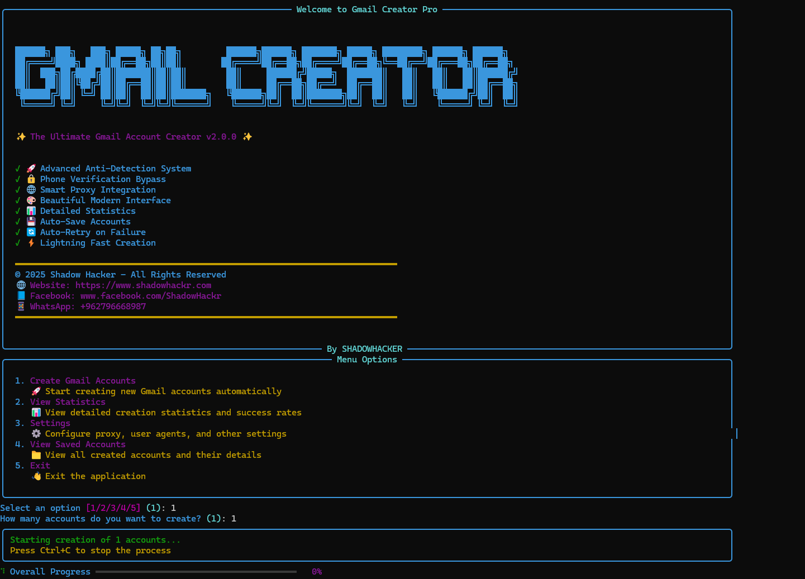

# 🚀 Gmail Creator Pro - The Ultimate Gmail Account Creator

<div align="center">


**✨ The Ultimate Automated Gmail Account Creation Tool ✨**

*Advanced Anti-Detection System • Phone Verification Bypass • 5sim Integration • Beautiful Modern Interface*

[Features](#-key-features) • [Installation](#-installation) • [Usage](#-usage) • [Configuration](#-configuration) • [Support](#-contact--support)

---



*Screenshot of Gmail Creator Pro v2.0.0 in action*

---

</div>

## 📋 Table of Contents

- [Overview](#-overview)
- [Key Features](#-key-features)
- [Screenshots](#-screenshots)
- [Requirements](#-requirements)
- [Installation](#-installation)
- [Configuration](#-configuration)
- [Usage](#-usage)
- [Project Structure](#-project-structure)
- [Advanced Features](#-advanced-features)
- [Troubleshooting](#-troubleshooting)
- [Security & Legal](#-security--legal)
- [Contributing](#-contributing)
- [Contact & Support](#-contact--support)
- [License](#-license)

---

## 🎯 Overview

**Gmail Creator Pro** is a powerful, feature-rich Python automation tool designed for automated Gmail account creation. Built with advanced anti-detection systems, intelligent phone verification bypass, and seamless 5sim API integration, this tool provides a professional solution for bulk Gmail account creation with a beautiful modern interface.

### What Makes This Tool Special?

- 🛡️ **Advanced Anti-Detection** - Human-like behavior simulation to avoid detection
- 🔄 **Smart Phone Verification** - Multiple bypass strategies + 5sim integration
- 🎨 **Beautiful UI** - Rich console interface with real-time progress tracking
- ⚡ **Lightning Fast** - Optimized performance for bulk account creation
- 🔒 **Secure & Configurable** - Separate config files for easy customization
- 📊 **Statistics Dashboard** - Track success rates and account details

---

## ✨ Key Features

### 🚀 Advanced Anti-Detection System
- **Human-like Typing Simulation** - Random delays between keystrokes (0.1-0.3s)
- **Session Warming** - Pre-browsing Google, BBC, Wikipedia, YouTube to appear human
- **Random User Agents** - Rotates browser fingerprints for each account
- **Natural Delays** - Random wait times between actions (0.5-1.2s)
- **Navigator Property Modification** - Hides automation signatures
- **Realistic Name Generation** - Uses names from external file for authenticity

### 🔒 Phone Verification Bypass
- **Multiple Skip Strategies** - Automatically detects and clicks skip buttons
- **Alternative Method Detection** - Tries "Try another way" options
- **5sim API Integration** - Automatic phone number purchase and SMS code retrieval
- **Smart Retry Logic** - Multiple fallback strategies if one fails
- **Multi-language Support** - Works with English and Arabic skip buttons

### 🌐 Smart Proxy Integration
- **Built-in Proxy Support** - FreeProxy integration for IP rotation
- **Automatic Proxy Selection** - Random proxy selection for each account
- **Proxy Validation** - Ensures proxy is working before use

### 💻 Beautiful Modern Interface
- **Rich Console UI** - Beautiful terminal interface with colors and animations
- **Real-time Progress Bars** - Visual progress tracking for account creation
- **Detailed Statistics** - Success rates, total accounts, active accounts
- **Color-coded Messages** - Green for success, red for errors, yellow for warnings
- **Interactive Menu** - Easy-to-use menu system

### 📊 Detailed Statistics
- **Total Accounts Created** - Track all created accounts
- **Active Accounts Count** - Monitor account status
- **Success Rate Percentage** - Calculate creation success rate
- **Last Creation Timestamp** - Track recent activity
- **Account Details** - View all saved account information

### 💾 Auto-Save Accounts
- **JSON Format Storage** - Structured account data storage
- **Automatic Backup** - Accounts saved immediately after creation
- **Account Metadata** - Includes email, password, creation date, status
- **Easy Export** - Simple JSON format for easy data export

### 🔄 Auto-Retry on Failure
- **Robust Error Handling** - Multiple retry attempts on failure
- **Element Detection** - Multiple selector strategies for finding elements
- **Page Load Retry** - Retries page loading if initial attempt fails
- **Smart Fallbacks** - Alternative methods if primary method fails

### ⚡ Lightning Fast Creation
- **Optimized Performance** - Efficient code for fast execution
- **Parallel Processing Ready** - Architecture supports future parallelization
- **Minimal Resource Usage** - Lightweight and efficient
- **Quick Browser Setup** - Fast Chrome driver initialization

### 🔐 Secure Configuration
- **Separate Config Files** - Easy to obfuscate main script while keeping configs editable
- **Password Protection** - Secure password storage in separate file
- **API Key Management** - Secure API key storage
- **No Hardcoded Secrets** - All sensitive data in external files

### 🎯 Additional Features
- **Custom User Agents** - Support for custom user agent lists
- **Custom Names Database** - Use your own name lists
- **Birthday Configuration** - Customizable birthday settings
- **Gender Selection** - Support for Male, Female, Other
- **Multi-language Support** - Works with English and Arabic interfaces
- **ChromeDriver Auto-Management** - Automatic ChromeDriver download and setup

---

## 📸 Screenshots

<div align="center">


*Gmail Creator Pro v2.0.0 - Main Interface*

</div>

### Interface Features:
- **Welcome Banner** - Beautiful ASCII art banner with version info
- **Feature List** - Visual checklist of all features
- **Menu System** - Interactive menu with 5 options
- **Progress Tracking** - Real-time progress bars
- **Statistics Dashboard** - Detailed account creation statistics

---
## 📚 Full Explanation

<div align="center">

### 🎥 YouTube Video Demo

[](https://youtu.be/2TucpXay1Sk)

### [Watch this video on YouTube](https://youtu.be/2TucpXay1Sk)

</div>

---

### 📝 In-Depth Technical Article

📖 Read the full step-by-step guide and detailed explanation here:  
👉 https://www.shadowhackr.com/2026/01/gmail-creator-pro.html
---
## 📋 Requirements

### System Requirements
- **Operating System:** Windows 10/11 (recommended)
- **Python Version:** Python 3.8 or higher (Python 3.12 recommended)
- **Chrome Browser:** Latest version installed
- **Internet Connection:** Stable internet connection required
- **RAM:** Minimum 4GB (8GB recommended)
- **Disk Space:** 500MB free space

### Python Dependencies

All dependencies are listed in `requirements.txt`. Install them using:

```bash
pip install -r requirements.txt
```

**Required Packages:**
- `selenium>=4.15.0` - Web automation framework
- `webdriver-manager>=4.0.0` - Automatic ChromeDriver management
- `rich>=13.7.0` - Beautiful terminal UI library
- `requests>=2.31.0` - HTTP library for API calls
- `unidecode>=1.3.7` - Text normalization
- `beautifulsoup4>=4.12.0` - HTML parsing
- `fp>=0.1.0` - Free proxy integration

### Optional Requirements
- **5sim API Key** - For automatic phone verification (optional but recommended)
- **Microsoft Visual C++ Build Tools** - For Nuitka compilation (optional)

---

## 🛠️ Installation

### Step 1: Clone the Repository

```bash
git clone https://github.com/ShadowHackrs/gmail-account-creator.git
cd Gmail2025
```

Or download the ZIP file and extract it.

### Step 2: Install Python Dependencies

```bash
pip install -r requirements.txt
```

### Step 3: Configure Settings

Before running the tool, you need to configure the following files:

#### 3.1. Password Configuration

Edit `config/password.txt`:
```
YourStrongPassword123!
```

**Password Requirements:**
- At least 8 characters
- Mix of uppercase, lowercase, numbers, and special characters
- Must meet Google's password requirements

#### 3.2. Names Configuration

Edit `data/names.txt`:
```
Ahmed Mohamed
Mohamed Ali
Omar Ibrahim
Sarah Ahmed
Shadow Hacker
...
```

**Format:**
- One name per line
- Format: "First Last" or just "First"
- Can add as many names as needed

#### 3.3. 5sim API Configuration (Optional but Recommended)

1. **Get your API key** from [5sim.net](https://5sim.net/)
2. **Add your API key** in `config/5sim_config.txt`:
```
your_api_key_here
```

3. **Configure country** in `config/config.py`:
```python
FIVESIM_COUNTRY = "usa"  # Options: usa, russia, ukraine, kazakhstan, etc.
FIVESIM_OPERATOR = "any"  # Options: any, virtual, etc.
```

#### 3.4. User Agents Configuration (Optional)

Edit `config/user_agents.txt`:
```
Mozilla/5.0 (Windows NT 10.0; Win64; x64) AppleWebKit/537.36 (KHTML, like Gecko) Chrome/120.0.0.0 Safari/537.36
Mozilla/5.0 (Windows NT 10.0; Win64; x64) AppleWebKit/537.36 (KHTML, like Gecko) Chrome/119.0.0.0 Safari/537.36
...
```

#### 3.5. General Configuration

Edit `config/config.py`:
```python
# Account Configuration
YOUR_BIRTHDAY = "2 4 1950"  # Format: "month day year"
YOUR_GENDER = "1"  # 1=Male, 2=Female, 3=Other
YOUR_PASSWORD = ""  # Leave empty to read from password.txt

# 5sim API Configuration
FIVESIM_API_KEY = ""  # Leave empty to read from 5sim_config.txt
FIVESIM_COUNTRY = "usa"
FIVESIM_OPERATOR = "any"

# Names Configuration
USE_ARABIC_NAMES = True
NAMES_FILE = "data/names.txt"
```

### Step 4: Verify Installation

Run the script to verify everything is set up correctly:

```bash
python auto_gmail_creator.py
```

You should see the welcome banner and menu. If you see any errors, check the [Troubleshooting](#-troubleshooting) section.

---

## ⚙️ Configuration

### Configuration Files Structure

```
config/
├── config.py          # General settings
├── password.txt       # Account password
├── 5sim_config.txt    # 5sim API key (optional)
└── user_agents.txt   # User agents list (optional)

data/
├── names.txt          # List of names
└── accounts.json      # Created accounts (auto-generated)
```

### Detailed Configuration Guide

#### Account Settings

**Birthday Format:** `"month day year"` (e.g., "2 4 1950")
- Month: 1-12
- Day: 1-31
- Year: 1900-2010 (must be 18+ years old)

**Gender Options:**
- `"1"` - Male
- `"2"` - Female
- `"3"` - Other

#### 5sim API Setup

**Available Countries:**
- `usa` - United States
- `russia` - Russia
- `ukraine` - Ukraine
- `kazakhstan` - Kazakhstan
- And many more (check [5sim.net](https://5sim.net/) for full list)

**Operator Options:**
- `any` - Any available operator
- `virtual` - Virtual numbers only
- Specific operator names

**Getting 5sim API Key:**
1. Visit [5sim.net](https://5sim.net/)
2. Create an account
3. Go to API section
4. Generate API key
5. Add balance to your account
6. Copy API key to `config/5sim_config.txt`

---

## 🚀 Latest Update (v2.1.0)

### ✨ New Release is Here!

We are excited to announce the latest update of **Gmail Creator Pro** with major improvements and enhancements.

🔗 Related Project / Update:  
https://github.com/ShadowHackrs/Gmail-infinity

---

### 🔥 What's New

- ⚡ Improved automation stability and performance
- 🛠️ Fixed multiple bugs in account creation flow
- 🎯 Better handling of UI changes and selectors
- 📊 Enhanced statistics tracking system
- 🔄 Optimized retry and recovery logic
- 💻 Improved overall interface responsiveness
- 🔐 Stronger configuration structure and file handling

---

### 📌 Notes

- This update focuses on **stability + performance improvements**
- Recommended to update dependencies using `requirements.txt`
- Ensure Chrome browser is updated for best compatibility

---

⭐ If you like this update, don’t forget to star the repository!
