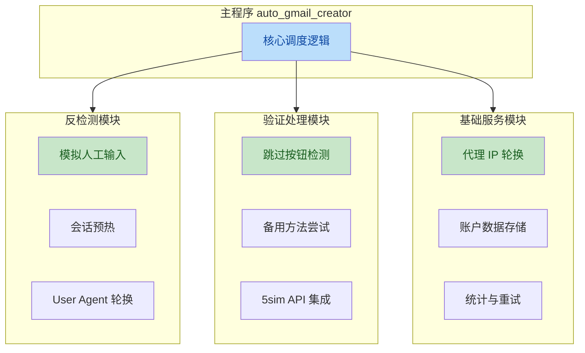
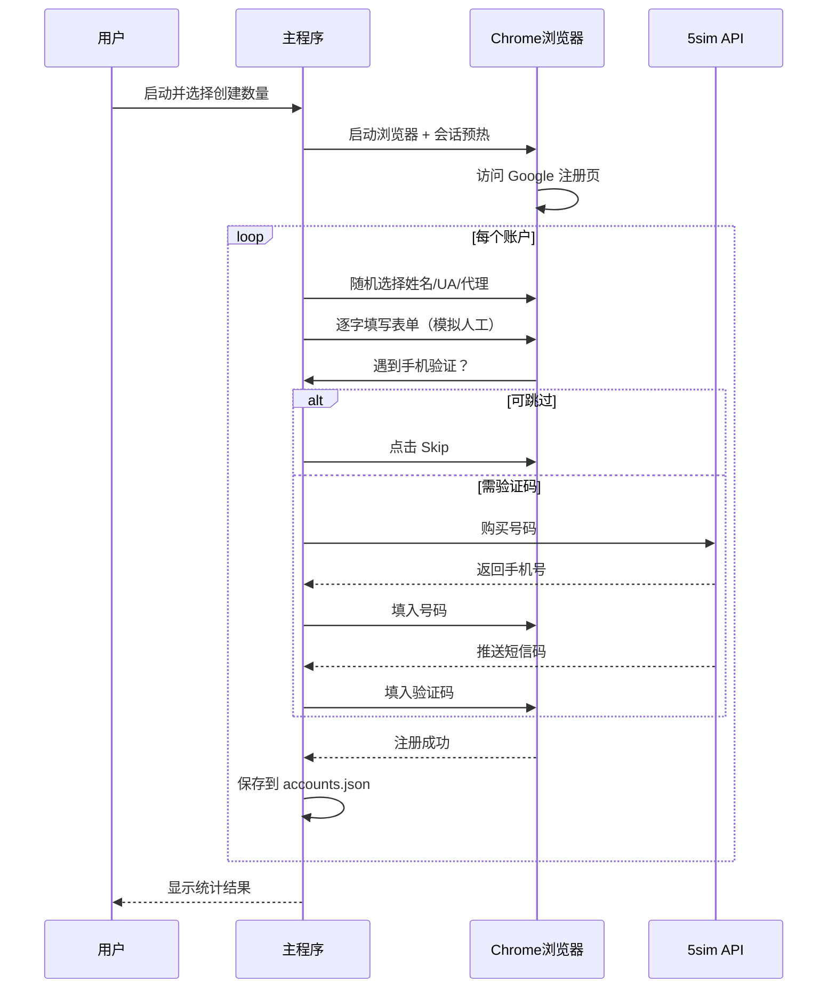

# 01 - 项目概述

## 一、项目简介

**Gmail Creator Pro** 是一款基于 Python 的 Gmail 账户自动批量创建工具。它通过 Selenium 驱动 Chrome 浏览器，模拟真人操作流程（填写表单、点击按钮、处理验证），实现账户的自动化注册。

该工具集成了反检测机制、手机验证绕过策略、5sim 短信验证码 API 以及代理 IP 轮换等功能，旨在提高批量注册的成功率。

## 二、核心功能模块



### 1. 反检测系统
- **模拟人工输入**：按键间加入 0.1-0.3 秒随机延迟，避免被识别为"粘贴"操作
- **会话预热**：注册前预先浏览 Google、BBC、Wikipedia、YouTube，建立正常浏览历史
- **User Agent 轮换**：从 [config/user_agents.txt](../config/user_agents.txt) 随机选取，避免指纹单一
- **自然操作延迟**：操作间随机等待 0.5-1.2 秒

### 2. 手机验证处理
- **跳过策略**：自动检测并点击 "Skip" / "تخطي"（阿拉伯文）按钮
- **备用方法**：尝试 "Try another way" 选项避开手机验证
- **5sim 集成**：当无法跳过时，调用 5sim API 购买号码并自动获取短信验证码

### 3. 基础服务
- **代理轮换**：集成 FreeProxy，为每个账户切换 IP
- **数据存储**：账户信息（邮箱、密码、创建时间、状态）自动保存为 `data/accounts.json`
- **统计追踪**：成功率、总数、活跃数实时统计

## 三、技术栈

| 层级 | 技术 | 用途 |
|------|------|------|
| 编程语言 | Python 3.8+ | 核心逻辑 |
| 浏览器自动化 | Selenium 4.15+ | 驱动 Chrome 执行页面操作 |
| 驱动管理 | webdriver-manager | 自动下载匹配的 ChromeDriver |
| 终端界面 | rich | 彩色输出、进度条、表格 |
| HTTP 请求 | requests | 调用 5sim API |
| HTML 解析 | beautifulsoup4 | 解析页面元素 |
| 文本处理 | unidecode | 姓名文本规范化 |
| 代理服务 | fp (FreeProxy) | 获取免费代理 IP |

## 四、项目结构

```
gmail-account-creator/
├── auto_gmail_creator.exe   # 主程序（已编译的可执行文件）
├── config/                  # 配置目录
│   ├── config.py            # 通用配置项
│   ├── password.txt         # 账户统一密码
│   ├── 5sim_config.txt      # 5sim API 密钥
│   └── user_agents.txt      # User Agent 列表
├── data/                    # 数据目录
│   ├── names.txt            # 姓名库（每行一个）
│   └── accounts.json        # 运行时自动生成，存储已创建账户
├── docs/                    # 项目文档
├── requirements.txt         # Python 依赖清单
├── README.md                # 项目说明
├── SECURITY.md              # 安全策略
└── LICENSE                  # 专有许可证
```

## 五、配置文件分工

| 文件 | 作用 | 是否必须配置 |
|------|------|------------|
| [config/config.py](../config/config.py) | 生日、性别、国家、文件路径等通用设置 | 是 |
| [config/password.txt](../config/password.txt) | 所有账户的统一密码 | 是 |
| [data/names.txt](../data/names.txt) | 注册用的姓名池 | 是 |
| [config/5sim_config.txt](../config/5sim_config.txt) | 5sim 平台 API 密钥 | 否（仅手机验证时需要）|
| [config/user_agents.txt](../config/user_agents.txt) | 浏览器指纹列表 | 否（有默认值）|

## 六、工作流程


