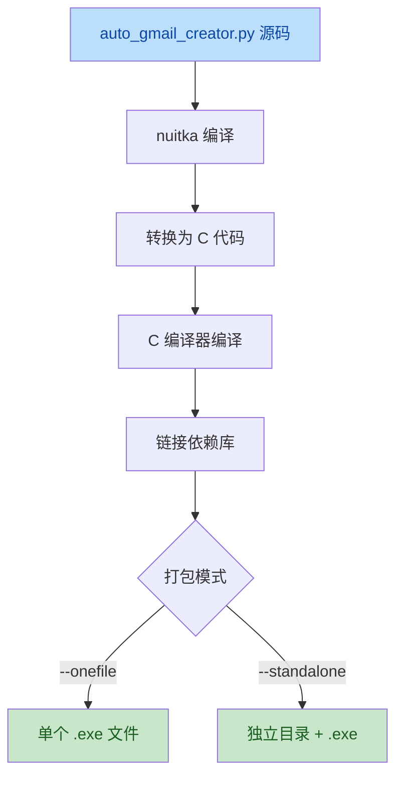

# 03 - 编译与打包指南

本文档说明如何将 Python 源代码编译为独立的可执行文件（.exe），便于分发和部署。项目当前根目录已提供编译好的 [auto_gmail_creator.exe](../auto_gmail_creator.exe)。

## 一、编译工具：Nuitka

项目使用 **Nuitka** 作为主要的编译打包工具。Nuitka 将 Python 代码转换为 C 代码再编译为机器码，相比 PyInstaller 具有以下优势：

| 特性 | Nuitka | PyInstaller |
|------|--------|-------------|
| 执行速度 | 更快（C 编译优化） | 一般 |
| 反逆向能力 | 较强 | 较弱 |
| 文件体积 | 较大 | 中等 |
| 兼容性 | 需 C 编译器 | 纯 Python |

## 二、环境准备

### 2.1 安装 Nuitka

```powershell
pip install nuitka
```

### 2.2 安装 C 编译器（必需）

Nuitka 需要 C 编译器将代码编译为二进制：

#### Windows 平台

**方式一：安装 Microsoft Visual C++ Build Tools（推荐）**

1. 访问 [visualstudio.microsoft.com](https://visualstudio.microsoft.com/visual-cpp-build-tools/) 下载 Build Tools
2. 安装时勾选 **"使用 C++ 的桌面开发"** 工作负载
3. 验证：
   ```powershell
   cl 2>&1 | Select-Object -First 1
   # 应输出 Microsoft C/C++ 编译器版本信息
   ```

**方式二：安装 MinGW-w64**

```powershell
# 通过 Chocolatey 安装
choco install mingw -y
```

#### Linux 平台

```bash
# Debian / Ubuntu
sudo apt install gcc build-essential -y

# CentOS / RHEL
sudo yum groupinstall "Development Tools" -y
```

## 三、编译流程

### 3.1 标准编译命令

在项目根目录执行：

```powershell
python -m nuitka `
    --standalone `
    --onefile `
    --enable-plugin=anti-bloat `
    --include-package=selenium `
    --include-package=webdriver_manager `
    --include-package=rich `
    --include-package=requests `
    --include-package=unidecode `
    --include-package=bs4 `
    --windows-console-mode=force `
    --output-filename=auto_gmail_creator.exe `
    auto_gmail_creator.py
```

### 3.2 参数说明

| 参数 | 作用 |
|------|------|
| `--standalone` | 生成独立目录，包含所有依赖 |
| `--onefile` | 打包为单个可执行文件（推荐分发）|
| `--enable-plugin=anti-bloat` | 去除不必要的依赖，减小体积 |
| `--include-package=<包名>` | 显式包含可能被漏检的包 |
| `--windows-console-mode=force` | 强制保留控制台窗口（显示 rich 界面）|
| `--output-filename` | 输出文件名 |

### 3.3 编译流程图



## 四、配置文件处理策略

> ⚠️ **重要原则**：配置文件（`config/`、`data/` 目录）**不打包**进 exe，保持外部可编辑。

编译后的可执行文件需要与 `config/` 和 `data/` 目录同级放置：

```
发布包结构：
├── auto_gmail_creator.exe   # 编译后的程序
├── config/                  # 配置（用户可编辑）
│   ├── config.py
│   ├── password.txt
│   ├── 5sim_config.txt
│   └── user_agents.txt
└── data/                    # 数据（用户可编辑）
    ├── names.txt
    └── accounts.json        # 运行时生成
```

这正是当前项目的目录结构设计。

## 五、编译优化选项

### 5.1 减小文件体积

```powershell
python -m nuitka `
    --standalone `
    --onefile `
    --lto=yes `                              # 链接时优化
    --remove-output `                         # 删除中间文件
    --nofollow-import-to=*.tests `            # 排除测试模块
    --nofollow-import-to=*.examples `         # 排除示例
    auto_gmail_creator.py
```

### 5.2 提升反逆向能力（可选）

```powershell
python -m nuitka `
    --standalone `
    --onefile `
    --module-name-choice=fast `               # 混淆模块名
    auto_gmail_creator.py
```

> 注：Nuitka 的混淆能力有限，如需更强保护建议配合代码混淆器（如 pyarmor）预处理后再编译。

## 六、常见编译问题

### 问题 1：缺少 C 编译器

**现象**：
```
Error, cannot find C compiler. Please install it.
```

**解决**：按 [2.2 节](#22-安装-c-编译器必需) 安装 Visual C++ Build Tools 或 MinGW。

### 问题 2：Selenium 模块未找到

**现象**：运行 exe 时报 `ModuleNotFoundError: No module named 'selenium'`

**解决**：显式指定包含：
```powershell
--include-package=selenium
--include-package=selenium.webdriver
```

### 问题 3：编译后无法找到配置文件

**现象**：exe 运行时提示找不到 `config/config.py`

**解决**：确保 exe 与 `config/`、`data/` 目录同级，不要将 exe 单独移动。

### 问题 4：rich 界面显示异常

**现象**：编译后颜色、进度条消失

**解决**：确保编译时加入：
```powershell
--windows-console-mode=force
```

## 七、编译验证

编译完成后，执行验证：

```powershell
# 1. 确认文件生成
Test-Path .\auto_gmail_creator.exe

# 2. 运行测试
.\auto_gmail_creator.exe
```

若显示欢迎横幅和主菜单，则编译成功。
