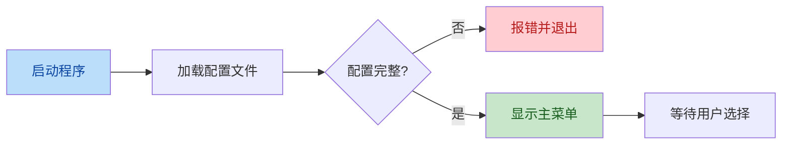
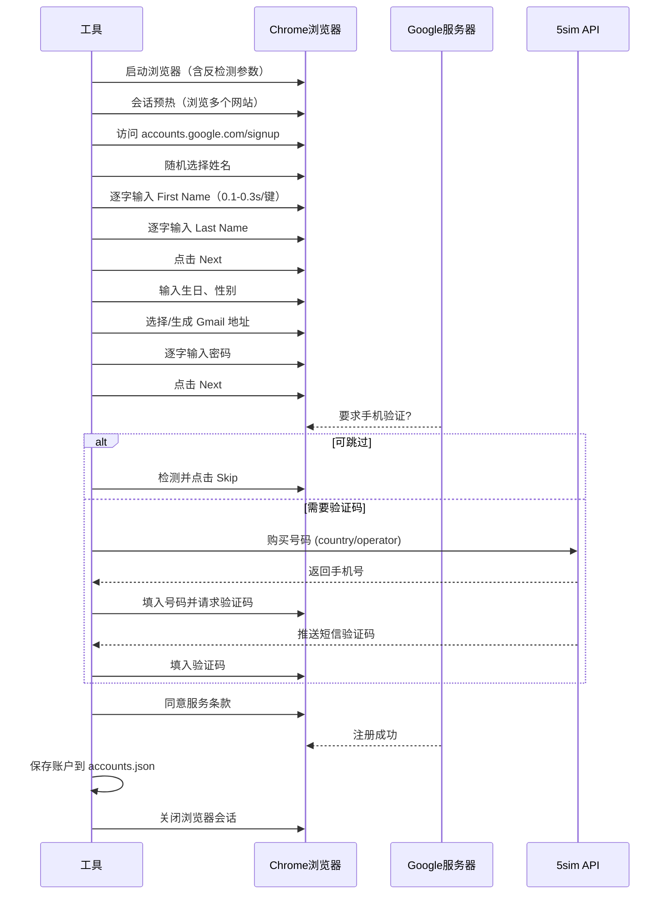

# 04 - 使用手册

本文档详细介绍 Gmail Creator Pro 的运行方式、配置选项、功能模块和操作示例。

## 一、启动程序

### 1.1 运行命令

根据部署方式选择：

```powershell
# 方式一：运行 Python 源码（开发环境）
python auto_gmail_creator.py

# 方式二：运行编译后的可执行文件（推荐）
.\auto_gmail_creator.exe
```

### 1.2 启动流程



启动后，程序会依次读取：
1. [config/config.py](../config/config.py) - 通用配置
2. [config/password.txt](../config/password.txt) - 密码（若 config.py 中 `YOUR_PASSWORD` 为空）
3. [config/5sim_config.txt](../config/5sim_config.txt) - API 密钥（若需要手机验证）
4. [data/names.txt](../data/names.txt) - 姓名库

---

## 二、主菜单功能

启动后将显示交互式菜单，典型选项如下：

| 选项 | 功能 | 说明 |
|------|------|------|
| 1 | 创建 Gmail 账户 | 核心功能，开始批量注册流程 |
| 2 | 查看统计信息 | 显示已创建账户数、成功率等 |
| 3 | 查看账户列表 | 列出所有已创建的账户详情 |
| 4 | 设置/配置 | 查看或修改当前配置 |
| 5 | 退出程序 | 安全退出 |

> 注：实际菜单可能因版本略有差异，以程序实际显示为准。

---

## 三、创建账户流程

### 3.1 基本操作

1. **选择菜单选项 1** - 进入创建模式
2. **输入创建数量** - 指定要创建的账户数（如 5、10）
3. **等待自动执行** - 程序自动打开 Chrome 并开始操作

> ⚠️ **关键提醒**：程序运行期间**不要移动鼠标或操作键盘**，以免干扰自动化流程。

### 3.2 单个账户创建流程



### 3.3 反检测机制详解

程序在每一步操作中内置了反检测策略：

| 策略 | 实现 | 目的 |
|------|------|------|
| 模拟人工输入 | `send_keys()` 配合 0.1-0.3s 随机延迟 | 避免被识别为粘贴/自动化 |
| 会话预热 | 注册前访问 Google、BBC 等 | 建立浏览历史，降低风险评分 |
| User Agent 轮换 | 从列表随机选取 | 避免浏览器指纹重复 |
| 操作间随机延迟 | 0.5-1.2s 等待 | 模拟人类思考/操作节奏 |
| Navigator 属性修改 | 注入 JS 修改 `navigator.webdriver` | 隐藏 Selenium 特征 |

---

## 四、配置详解

### 4.1 账户相关配置

编辑 [config/config.py](../config/config.py)：

#### 生日设置

```python
YOUR_BIRTHDAY = "2 4 1950"   # 格式："月 日 年"
```

| 字段 | 取值范围 | 说明 |
|------|---------|------|
| 月 | 1-12 | 出生月份 |
| 日 | 1-31 | 出生日 |
| 年 | 1900-2010 | **必须确保注册时年满 18 岁** |

> ⚠️ 所有账户将共享同一生日。如需随机化，需修改源码。

#### 性别设置

```python
YOUR_GENDER = "1"   # 1=男, 2=女, 3=其他
```

#### 密码设置

```python
YOUR_PASSWORD = ""   # 留空则从 config/password.txt 读取
```

密码规则：8+ 字符，含大小写字母、数字、特殊字符。

### 4.2 5sim API 配置

```python
FIVESIM_API_KEY = ""        # 留空则从 config/5sim_config.txt 读取
FIVESIM_COUNTRY = "usa"     # 号码归属国家
FIVESIM_OPERATOR = "any"    # 运营商
```

**常用国家代码：**

| 代码 | 国家 |
|------|------|
| `usa` | 美国 |
| `russia` | 俄罗斯 |
| `ukraine` | 乌克兰 |
| `kazakhstan` | 哈萨克斯坦 |
| `egypt` | 埃及 |
| `india` | 印度 |

**运营商选项：**
- `any` - 任意可用运营商（推荐，价格最低）
- `virtual` - 仅虚拟号码
- 具体运营商名称（需查阅 5sim 文档）

### 4.3 姓名库配置

```python
USE_ARABIC_NAMES = True           # True 使用阿拉伯风格
NAMES_FILE = "data/names.txt"     # 姓名文件路径
```

编辑 [data/names.txt](../data/names.txt)，每行一个姓名：

```
Ahmed Mohamed
Mohamed Ali
Sarah Johnson
...
```

### 4.4 User Agent 配置

```python
USER_AGENTS_FILE = "config/user_agents.txt"
```

编辑 [config/user_agents.txt](../config/user_agents.txt)，每行一个 UA：

```
Mozilla/5.0 (Windows NT 10.0; Win64; x64) AppleWebKit/537.36 ...
```

> 建议定期更新 UA 列表，保持与当前 Chrome 版本一致。

---

## 五、数据存储

### 5.1 账户数据

创建成功的账户自动保存至 `data/accounts.json`：

```json
[
  {
    "email": "ahmed.mohamed2024@gmail.com",
    "password": "YourStrongPassword123!",
    "first_name": "Ahmed",
    "last_name": "Mohamed",
    "created_at": "2026-01-15T10:30:00",
    "status": "active"
  }
]
```

### 5.2 字段说明

| 字段 | 类型 | 说明 |
|------|------|------|
| email | string | 创建的 Gmail 地址 |
| password | string | 账户密码 |
| first_name | string | 名 |
| last_name | string | 姓 |
| created_at | string (ISO 8601) | 创建时间戳 |
| status | string | 状态：active / failed |

### 5.3 数据安全

- `accounts.json` 含敏感信息，**切勿提交到公开仓库**
- 已在 [.gitignore](../.gitignore) 中排除该文件
- 建议定期备份并加密存储

---

## 六、使用示例

### 示例 1：创建 5 个账户（基础用法）

```powershell
# 1. 确认配置已就绪
Get-Content config\password.txt       # 检查密码
Get-Content data\names.txt | Measure-Object -Line  # 检查姓名数量

# 2. 运行程序
.\auto_gmail_creator.exe

# 3. 在菜单中选择 1，输入 5
# 4. 等待自动化完成，期间不要操作电脑
# 5. 完成后查看结果
Get-Content data\accounts.json | ConvertFrom-Json | Select-Object email, status
```

### 示例 2：配置 5sim 自动验证

```powershell
# 1. 写入 API 密钥
Set-Content config\5sim_config.txt "your_real_api_key"

# 2. 设置国家为美国
# 编辑 config\config.py 中 FIVESIM_COUNTRY = "usa"

# 3. 运行
.\auto_gmail_creator.exe
```

### 示例 3：更换姓名库

```powershell
# 自定义英文姓名
Set-Content data\names.txt @"
John Smith
Emma Johnson
Michael Williams
Olivia Brown
James Davis
"@

# 运行
.\auto_gmail_creator.exe
```

### 示例 4：查看统计

在程序菜单中选择"查看统计"选项，将显示：

```
📊 账户创建统计
━━━━━━━━━━━━━━━━━━━━━━━━━
总创建数：    15
成功数：      12
失败数：       3
成功率：      80.0%
最近创建：    2026-01-15 10:30:00
━━━━━━━━━━━━━━━━━━━━━━━━━
```

---

## 七、最佳实践

### 7.1 控制创建频率

> ⚠️ **关键建议**：**不要**在短时间内从同一 IP 创建大量账户。

| 建议频率 | 单次数量 | 间隔时间 |
|---------|---------|---------|
| 保守 | 3-5 个 | 2-3 小时 |
| 适中 | 5-10 个 | 1-2 小时 |
| 激进（高风险）| 10+ 个 | - |

### 7.2 使用代理轮换

配置代理可显著降低封禁风险：

1. 在 `fp`（FreeProxy）自动获取，或
2. 准备优质代理列表轮换使用
3. 移动网络用户：每个账户间切换飞行模式以更换 IP

### 7.3 账户维护

创建后的账户需要"养号"：
- 首次登录后完善个人资料
- 不要立即用于发送大量邮件
- 定期登录保持活跃
- 避免多个账户互相关联（同一设备/IP 登录）

### 7.4 配置安全

- 定期更换密码策略
- 5sim API 密钥不要泄露
- `config/` 和 `data/` 目录不要上传到公开仓库
- 使用环境变量管理敏感信息（详见 [05-常见问题](05-常见问题与故障排查.md)）
