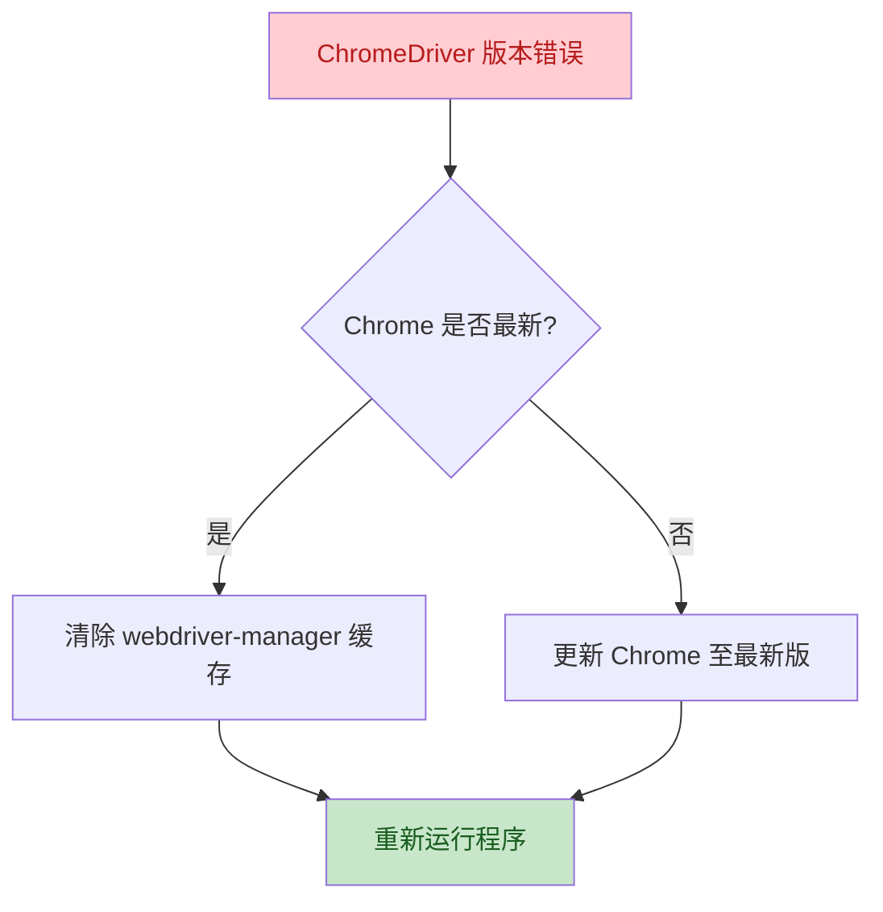
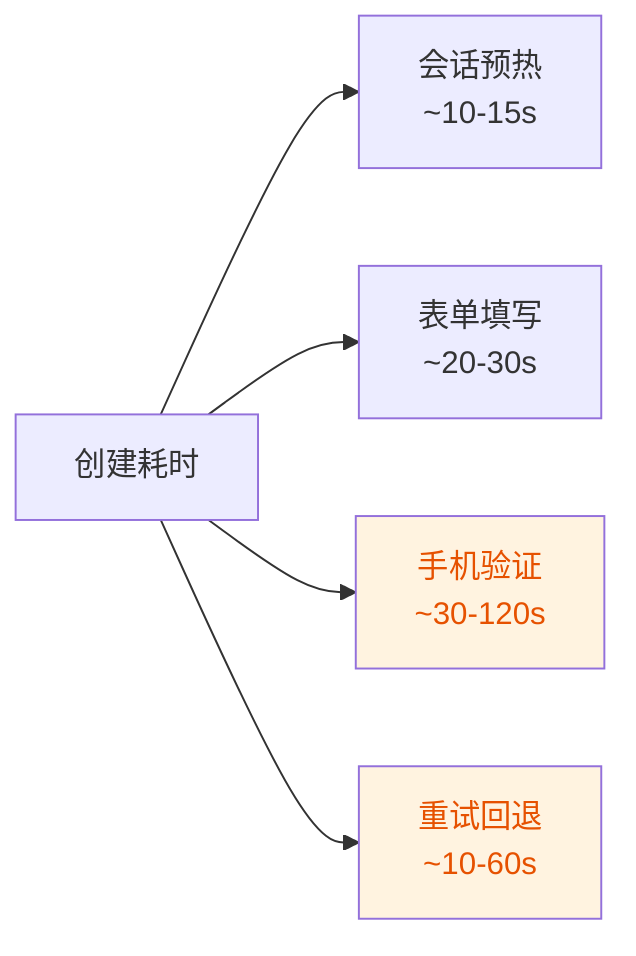

# 05 - 常见问题与故障排查

本文档汇总项目使用过程中的常见问题、错误现象及解决方案。

---

## 一、安装与环境问题

### Q1：`pip install` 安装依赖失败

**现象**：
```
ERROR: Could not find a version that satisfies the requirement selenium
```

**原因与解决**：

| 可能原因 | 解决方案 |
|---------|---------|
| pip 版本过旧 | `python -m pip install --upgrade pip` |
| 网络连接问题 | 使用国内镜像源：`pip install -r requirements.txt -i https://pypi.tuna.tsinghua.edu.cn/simple` |
| Python 版本过低 | 确认 Python >= 3.8，推荐 3.12 |

---

### Q2：`fp` 包安装失败或运行报错

**现象**：
```
ModuleNotFoundError: No module named 'fp'
```
或运行时代理功能不可用。

**原因**：`fp`（FreeProxy）为小众包，稳定性有限。

**解决**：
```powershell
# 方式一：单独安装
pip install fp

# 方式二：如持续失败，可暂时禁用代理功能
# 在源码中注释代理相关逻辑（需修改源码）
```

---

### Q3：Python 版本不兼容

**现象**：运行时出现语法错误或 `TypeError`

**解决**：
```powershell
# 检查版本
python --version

# 必须 >= 3.8，推荐 3.12
# 如版本过低，请从 python.org 重新安装
```

---

## 二、运行时错误

### Q4：Chrome / ChromeDriver 版本不匹配

**现象**：
```
SessionNotCreatedException: This version of ChromeDriver only supports Chrome version XXX
```

**原因**：本地 Chrome 浏览器版本与自动下载的 ChromeDriver 不匹配。

**解决**：



**操作步骤**：
1. 更新 Google Chrome 至最新版（地址栏输入 `chrome://settings/help`）
2. 清除 webdriver-manager 缓存：
   ```powershell
   Remove-Item -Recurse -Force "$env:USERPROFILE\.wdm" -ErrorAction SilentlyContinue
   ```
3. 重新运行程序，让 webdriver-manager 重新下载匹配版本

---

### Q5：找不到配置文件

**现象**：
```
FileNotFoundError: config/config.py
```

**原因**：程序依赖相对路径，工作目录不正确。

**解决**：
```powershell
# 确保在项目根目录运行
cd e:\gmail-account-creator

# 验证目录结构
Test-Path config\config.py
Test-Path config\password.txt
Test-Path data\names.txt
```

> ⚠️ 编译后的 `auto_gmail_creator.exe` 必须与 `config/` 和 `data/` 目录同级放置。

---

### Q6：Selenium 无法启动浏览器

**现象**：
```
WebDriverException: unknown error: cannot find Chrome binary
```

**原因**：系统未安装 Chrome 或路径异常。

**解决**：
1. 确认已安装 Google Chrome（非 Chromium 或 Edge）
2. 验证安装路径：
   ```powershell
   Test-Path "C:\Program Files\Google\Chrome\Application\chrome.exe"
   ```
3. 如路径异常，重新安装 Chrome

---

### Q7：页面元素找不到（ElementNotInteractable / NoSuchElementException）

**现象**：程序运行中报错，无法找到输入框或按钮。

**原因**：
- Google 注册页 UI 更新
- 页面加载缓慢
- 反自动化检测导致元素隐藏

**解决**：
1. **更新程序版本**：本项目 v2.1.0 已优化选择器兼容性
2. **检查网络**：确保网络稳定，页面能完整加载
3. **降低创建频率**：连续失败时暂停，间隔后再试
4. **如使用源码**：可手动更新 [auto_gmail_creator.py](../auto_gmail_creator.py) 中的选择器（需反查 Google 当前页面元素）

---

## 三、手机验证问题

### Q8：无法跳过手机验证

**现象**：程序卡在手机验证步骤，无法自动跳过。

**原因**：Google 风控严格，强制要求手机验证。

**解决方案**：

| 方案 | 操作 | 效果 |
|------|------|------|
| 配置 5sim | 在 [config/5sim_config.txt](../config/5sim_config.txt) 填入 API 密钥 | 自动购买号码接收验证码 |
| 更换 IP | 使用代理或切换飞行模式 | 降低风控等级，可能恢复跳过选项 |
| 会话预热 | 确保程序执行预热流程 | 建立信任度 |
| 降低频率 | 每日少量创建 | 减少风控触发 |

---

### Q9：5sim API 调用失败

**现象**：
```
5sim API Error: Unauthorized / Insufficient funds
```

**原因与解决**：

| 错误 | 原因 | 解决 |
|------|------|------|
| Unauthorized | API 密钥错误或过期 | 重新生成密钥并更新 [config/5sim_config.txt](../config/5sim_config.txt) |
| Insufficient funds | 账户余额不足 | 登录 [5sim.net](https://5sim.net/) 充值 |
| No numbers | 所选国家/运营商无可用号码 | 更换 `FIVESIM_COUNTRY` 或使用 `any` 运营商 |
| Timeout | 短信接收超时 | 更换号码重试，部分号码收码慢 |

---

## 四、编译相关问题

### Q10：Nuitka 编译报错 "cannot find C compiler"

**现象**：
```
Error, cannot find C compiler.
```

**解决**：详见 [03-编译与打包指南.md](03-编译与打包指南.md) 第 2.2 节，安装 Visual C++ Build Tools 或 MinGW。

---

### Q11：编译后的 exe 运行闪退

**现象**：双击 exe 后窗口一闪而过。

**排查步骤**：
```powershell
# 在终端中运行，查看错误输出
.\auto_gmail_creator.exe

# 常见原因：
# 1. 缺少 config/ 或 data/ 目录
# 2. 配置文件内容为空
# 3. 依赖包未正确打包
```

**解决**：
1. 确认 exe 与 config/、data/ 同级
2. 检查配置文件是否有有效内容
3. 编译时加入 `--include-package` 显式包含所有依赖

---

## 五、性能与稳定性

### Q12：创建速度很慢

**原因分析**：



**优化建议**：
- 手机验证是最主要的耗时环节，配置 5sim 可减少重试
- 单账户正常耗时约 1-3 分钟（含验证）
- 程序为串行执行，不支持并发（如需加速需修改源码）

---

### Q13：成功率低

**可能原因与对策**：

| 原因 | 对策 |
|------|------|
| 同 IP 频繁创建 | 使用代理轮换，单 IP 每日不超过 3-5 个 |
| User Agent 过时 | 更新 [config/user_agents.txt](../config/user_agents.txt) 为最新 Chrome 版本 |
| 姓名库过小 | 扩充 [data/names.txt](../data/names.txt) 至 100+ 条 |
| 生日/性别固定 | 多账户共享同一信息易被关联 |
| Chrome 版本与 UA 不符 | 保持两者版本号接近 |

---

### Q14：程序运行中卡死

**现象**：程序在某一步骤长时间无响应。

**解决**：
1. 按 `Ctrl + C` 中断当前操作
2. 检查网络连接
3. 重启程序
4. 如反复卡死在同一位置，可能是 Google 页面结构变更，需更新程序

---

## 六、数据与安全

### Q15：accounts.json 文件丢失或损坏

**现象**：已创建的账户记录消失。

**预防与恢复**：
```powershell
# 定期备份
Copy-Item data\accounts.json "data\accounts_backup_$(Get-Date -Format 'yyyyMMdd').json"

# 如文件损坏，从备份恢复
Copy-Item data\accounts_backup_20260115.json data\accounts.json
```

---

### Q16：敏感信息泄露风险

**风险点**：

| 文件 | 风险 | 防护 |
|------|------|------|
| config/password.txt | 密码明文 | 加入 .gitignore，不提交仓库 |
| config/5sim_config.txt | API 密钥明文 | 同上 |
| data/accounts.json | 账户全量信息 | 同上 |

**验证 .gitignore 生效**：
```powershell
# 确认敏感文件未被 git 追踪
git status
# accounts.json、password.txt 等不应出现在待提交列表
```

---

## 七、获取帮助

如以上文档无法解决您的问题：

1. **查阅源文档**：[官方详细教程](https://www.shadowhackr.com/2026/01/gmail-creator-pro.html)（阿拉伯语）
2. **观看视频演示**：[YouTube 教程视频](https://youtu.be/2TucpXay1Sk)
3. **检查项目更新**：[Gmail-infinity 关联项目](https://github.com/ShadowHackrs/Gmail-infinity)
4. **提交问题**：通过 GitHub Issues 反馈具体错误信息
